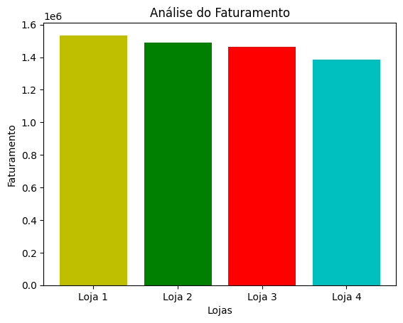
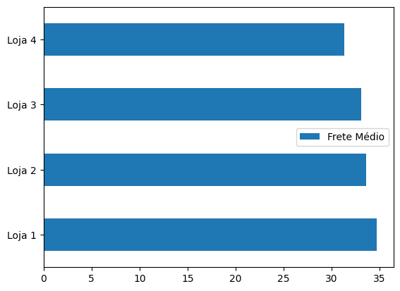

# 📊 Alura Store Brasil — Análise de Dados

## 🎯 Propósito da Análise

Este projeto tem como objetivo realizar uma **análise exploratória de dados (EDA)** das vendas da rede *Alura Store Brasil* que pertencem ao Sr.João, a fim de apoiar uma **decisão estratégica de negócio**: **identificar qual das lojas deveria ser vendida para que o Sr.João possa ter o capital para começar um novo empreendimento**.

A análise considera múltiplas métricas relevantes para o negócio, como:

### Faturamento total por loja



> **Insight:** uma das lojas apresenta faturamento significativamente inferior às demais.


### Avaliação média dos clientes


> **Insight:** algumas lojas se destacam significativamente mais do que outras na avaliação dos clientes, como a Loja 3 na categoria Brinquedos.

### Custo médio de frete



> **Insight:** mesmo quando o frete é competitivo, isso não garante bom desempenho de vendas, como no caso da loja 4 que tem frete baixo mas ainda sim possui o menor faturamento.


### Quantidade de vendas


> **Insight** É possível observar quais categorias são mais populares e quais não são, e também o quanto cada loja se destaca em cada categoria.


📌 **Conclusão geral:** considerando todos os indicadores analisados, uma das lojas se destaca negativamente e é recomendada para venda por apresentar o pior desempenho global.

---

## 🗂️ Estrutura do Projeto

```
challengedadosalura/
│
├── AluraStoreBrasil.ipynb   # Notebook principal com toda a análise
├── dados/                  # (opcional) Pasta para arquivos CSV, caso separados
└── README.md               # Documentação do projeto
```

### 📒 AluraStoreBrasil.ipynb

Notebook em Python contendo:

* Importação dos dados
* Análises estatísticas
* Agrupamentos por loja e categoria
* Visualizações gráficas
* Conclusão final baseada nos dados

---

## ▶️ Instruções para Executar o Notebook

### 1️⃣ Pré-requisitos

Certifique-se de ter instalado:

* Python 3.8 ou superior
* Jupyter Notebook ou Jupyter Lab

### 2️⃣ Instalação das Bibliotecas

Instale as bibliotecas necessárias com:

```bash
pip install pandas matplotlib jupyter
```

### 3️⃣ Execução

1. Clone este repositório:

   ```bash
   git clone https://github.com/samarawwleticia/challengedadosalura.git
   ```
2. Acesse a pasta do projeto:

   ```bash
   cd challengedadosalura
   ```
3. Inicie o Jupyter Notebook:

   ```bash
   jupyter notebook
   ```
4. Abra o arquivo **AluraStoreBrasil.ipynb** e execute as células em ordem.

---

## 🧠 Tecnologias Utilizadas

<div align="left">
  
  
  
  
</div>

---

✨ Projeto desenvolvido como parte do **1° Challenge de Dados da formação ONE com a Alura**, com foco em análise de dados aplicada a decisões reais de negócio.
